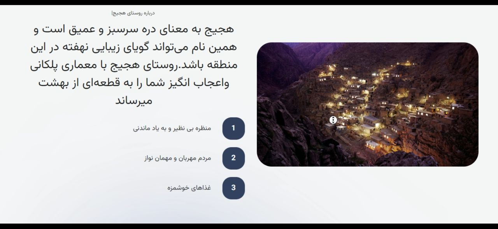
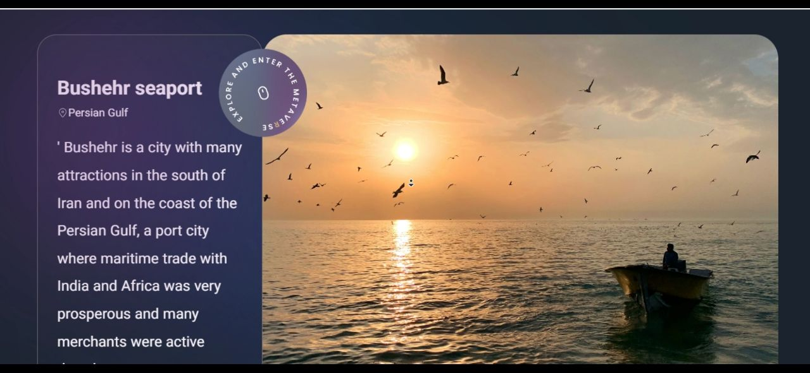

### Hi every one

This page is like a tour guide showcasing the beautiful tourist attractions of my country, Iran.
For the animation, I used the Framer Motion library and for the style, I used Tailwind CSS.

Online Demo : www.tourman2002.netlify.app

---

### Languages and Tools:

  
      
       
     
     

   
   
  

---

### 📌Where to find me

  

    

---

